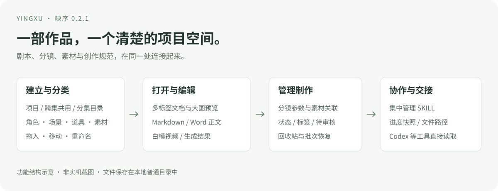

# 映序 · AI 资产与项目管理

[工具总入口](https://github.com/turnsolesama/portfolio) · [仓库迁移说明](MIGRATION.md)



**以创作项目为中心的 AI 资产与项目管理工具。** 按作品整理图片、视频、文稿、角色、分镜和生成版本，编辑文稿并跟踪制作状态。剧本、跨集角色、道具和白模预演等资料都可归入同一个项目。

选用重点：整理某个作品的素材和制作进度，使用映序；集中管理跨项目复用的模型、LoRA、工作流与出图库，可查看 [AI Hub](https://github.com/turnsolesama/ai-hub)。

浅色中文界面，多标签文件工作区，普通目录保存素材。原创代码采用 [MIT](LICENSE)，无需订阅或云账号。

本仓库独立维护映序的公开源码与文档。[各平台发布包与校验](https://github.com/turnsolesama/yingxu/releases)集中在本仓库；既有 `portfolio` Releases 的历史包与下载地址保留。

源码新增：[从文件夹导入项目](docs/project-folder-import.md)。拖到左侧项目库，复制到配置的存放位置并自动归类；此功能尚未包含在下方 0.4.15 发布包中。

**[下载 Windows x64 完整包 · v0.4.15](https://github.com/turnsolesama/yingxu/releases/download/yingxu-v0.4.15/YingXu-v0.4.15-Windows-x64.zip)** · [校验与发布说明](https://github.com/turnsolesama/yingxu/releases/tag/yingxu-v0.4.15)

自带 Python、图片处理组件、FFmpeg 和 WebView2，完整解压后双击即可使用。

[下载 macOS M 系列 0.4.15-mac.1 试用包与校验](https://github.com/turnsolesama/yingxu/releases/tag/yingxu-v0.4.15-mac.1)，适用于 macOS 14+、Apple Silicon（arm64）。仅使用发布页中已公开的附件；试用版未公证，也尚未完成人工中文输入法与不同 DPI 显示环境验收。[原 macOS 0.4.3 试用包](https://github.com/turnsolesama/portfolio/releases/tag/yingxu-v0.4.3)仍保留。

**0.4.15 已发布：Windows 截图线宽选择。** Windows 与 macOS 分别完成完整包验证和上传后下载回检。

- 点击截图工具栏的线宽按钮，可在弹层中直接选择 2、4、8、12 像素，并查看各档粗细；不再只能逐次点击循环切换。
- 选择后自动收起弹层；弹层打开时，按 Esc 或点击外部只收起选项，保留当前截图，也不会因这次点击误画笔迹。
- 已通过 930 项实际窗口绘制与交互检查；使用合成截图内容，不代表已完成人工多显示器及真实剪贴板验收。
- macOS 仅同步版本，未新增截图或标注功能。无新增运行依赖、启动联网或后台轮询。

[Windows 0.4.14 历史包](https://github.com/turnsolesama/yingxu/releases/tag/yingxu-v0.4.14) · [macOS 0.4.14-mac.1 历史包](https://github.com/turnsolesama/yingxu/releases/tag/yingxu-v0.4.14-mac.1)

**0.4.14 已发布：Windows 截图工具栏与绘制修复。** Windows 与 macOS 由同一来源提交构建，分别完成完整包验证和上传后下载回检。

- 截图标注工具、色板与操作按钮分组排列，统一图标、选中与按下反馈；工具栏随缩放调整间距，窄屏可换行，保持在屏幕范围内。
- 修复真实窗口重绘时出现的黑底、重复图标与重影；切换工具、颜色和悬停后重新绘制背景，保留画笔、矩形、箭头、马赛克、撤销与确认等既有操作。
- 使用实际窗口消息重绘检查正常与窄屏布局，并在 100%、150%、200% 缩放下验证；这不等于已完成人工多显示器组合验收。
- macOS 仅同步版本与来源提交，未新增 Windows 专属截图功能。无新增运行依赖、启动联网或后台轮询。

[Windows 0.4.13 历史包](https://github.com/turnsolesama/yingxu/releases/tag/yingxu-v0.4.13) · [macOS 0.4.13-mac.1 历史包](https://github.com/turnsolesama/yingxu/releases/tag/yingxu-v0.4.13-mac.1)

**0.4.13 已发布：回收站清理确认修复。** Windows 与 macOS 由同一来源提交构建，均已通过完整包验证和上传后下载回检。

- 清理失败或确认失效后，可点击“重新预览”，核对新清单后再次确认；不会反复提交失效凭据，也不会自动重试删除。
- 被保留的条目显示具体名称，区分活动引用与其他回收批次；先处理子文件后，可重新预览父目录。
- 保留 0.4.12 的手动检查更新、笔记图片兼容和阅读布局；无新增依赖、启动联网或后台轮询。

[Windows 0.4.12 历史包](https://github.com/turnsolesama/yingxu/releases/tag/yingxu-v0.4.12) · [macOS 0.4.12-mac.1 历史包](https://github.com/turnsolesama/yingxu/releases/tag/yingxu-v0.4.12-mac.1)

**0.4.12 已发布：笔记图片兼容、阅读布局与手动更新。** Windows 与 macOS 由同一来源提交构建，分别完成完整包验证和上传后下载回检。

- 设置顶部新增“手动更新 → 检查更新”，按当前平台显示发布版本、说明和下载入口。只在点击时连接 GitHub，不自动下载安装。
- Markdown 支持 Obsidian 图片引用和尺寸语法，可拖入、粘贴或选择图片插入笔记草稿；原文、原附件和普通文字粘贴保留。
- 阅读默认扩大正文区域，可按需展开文件列表，优化长文排版。
- Windows 从不同安装位置反复打开时，复用同一数据目录的桌面实例。
- 无新增运行依赖或后台轮询。macOS 仍限 Apple Silicon 试用范围；人工输入法、权限和长期稳定性仍需反馈。

[Windows 0.4.11 历史包](https://github.com/turnsolesama/yingxu/releases/tag/yingxu-v0.4.11) · [macOS 0.4.11-mac.1 历史包](https://github.com/turnsolesama/yingxu/releases/tag/yingxu-v0.4.11-mac.1)

**0.4.11 已发布：拖拽导入修复与跨项目移动。** Windows 与 macOS 共享相同功能代码，并分别完成上传后完整下载、解压与隔离验证。Windows 来源提交另含浏览器测试等待及临时测试目录清理修正，不改变应用功能。

- Windows 资源区从文件夹拖入文件时，使用原生文件路径并复用文件选择导入队列；无磁盘路径的图片仍使用上传。传输失败会核实本地服务状态，避免把导入失败直接误报为断连。
- Windows 打开、定位文件夹由桌面宿主发起，匹配 Explorer 窗口并尝试前台显示；用户切换其他应用后不继续抢焦点。
- 素材可拖到左侧其他项目，选择目标分类和文件夹后移动，也可通过“移动到”选择其他项目。先复制、校验，再提交记录和清理源文件；外部引用保留原文件位置。
- 移动保留条目身份、历史、完整素材组与批次内关系；部分素材组、跨批次本地文稿链接会明确拒绝。最多 200 项、受管文件合计 2 GiB，大文件移动期间暂停冲突写入。
- 无新增启动扫描、模型或运行依赖。原生拖拽桥接和窗口行为使用隔离测试，仍需对方电脑复测；macOS 维持 M 系列试用范围。

[Windows 0.4.10 历史包](https://github.com/turnsolesama/yingxu/releases/tag/yingxu-v0.4.10) · [macOS 0.4.10-mac.1 历史包](https://github.com/turnsolesama/yingxu/releases/tag/yingxu-v0.4.10-mac.1)

**0.4.10 已发布：项目存放位置与迁移。** Windows 和 macOS 使用同一份功能源码，分别完成最终包验证与上传后下载回检。

- 在“设置 → 项目存放位置”选择新文件夹，预览后确认保存，自动复制并迁移全部活动项目；不必逐个搬动。
- 磁盘目录遵循“项目分类 / 项目 / 文本、角色等分类”，例如“个人作品 / 练习 / 文本 / 剧本.md”。导入默认复制到当前分类，也可选择引用原文件。
- 副本逐项校验后切换位置；原目录保留作备份，外部引用保持原位置，保留素材身份与历史记录。失败继续使用原位置，意外中断后核对数据库与设置恢复一致。
- 迁移前检查未保存内容，期间暂停编辑和导入；进度断连可重试同一任务，后台重启后重新读取实际位置。无需新增模型或运行依赖。

详情见[项目存放位置与分类目录](docs/功能指南.md#项目存放位置与分类目录)。完成后在新位置工作，原目录作为迁移时的备份保留。

[Windows 0.4.9 历史包](https://github.com/turnsolesama/yingxu/releases/tag/yingxu-v0.4.9) · [macOS 0.4.9-mac.1 历史包](https://github.com/turnsolesama/yingxu/releases/tag/yingxu-v0.4.9-mac.1)

**0.4.9 已发布：浏览器图片粘贴修复。** Windows 正式包与 macOS 0.4.9-mac.1 试用包分别完成构建、隔离验证和上传后完整下载回检。

- 在浏览器中复制图片后，可用 Ctrl+V（macOS 可用 ⌘V）或资源区右键“粘贴”导入当前分类、文件夹。
- 支持浏览器提供的图片文件和系统剪贴板位图；系统位图保存为 PNG，保留透明度，同名文件不覆盖。仅复制图片地址不会下载图片。
- 粘贴期间固定目标位置并防止重复操作；文稿与输入框保留原来的文字粘贴行为。沿用 0.4.8 启动优化，无新增模型或运行依赖。

图片粘贴回归使用合成位图、模拟剪贴板与浏览器事件，不能代替每台电脑、每种浏览器的真实剪贴板验收。另有用户反馈的“本地连接中断”发生在其他电脑，尚未定位，不属于本次已确认修复项。

[Windows 0.4.8 历史包](https://github.com/turnsolesama/yingxu/releases/tag/yingxu-v0.4.8) · [macOS 0.4.8-mac.1 历史包](https://github.com/turnsolesama/yingxu/releases/tag/yingxu-v0.4.8-mac.1)

**0.4.8 已发布：启动提速与创作交互改进。** Windows 与 macOS 安装包分别完成构建、隔离验证和上传后完整下载回检，保留原有功能与历史版本。

- Windows 减少空端口连接等待，后台与 WebView2 并行初始化；SKILL 扫描移到后台，项目和分类信息同时读取，工作台更早可用。实际启动时间取决于本机环境和项目规模。
- 新项目直接归入项目库当前选中的分类，并立即出现在左侧；创建成功后的刷新重试不会重复建项目。
- 图片预览支持按住鼠标中键拖动位置；弹窗标题和关闭按钮固定在滚动内容外。
- Markdown 实时预览支持表格，可从表格定位回源码编辑，保留原始文稿和输入法状态。
- Windows 截图新增矩形、箭头、Shift 画直线、马赛克与桌面置顶，工具栏采用图标和色板。macOS 试用版仍不提供截图及原生拖出。

[Windows 0.4.7 历史包](https://github.com/turnsolesama/yingxu/releases/tag/yingxu-v0.4.7) · [macOS 0.4.7-mac.1 历史包](https://github.com/turnsolesama/yingxu/releases/tag/yingxu-v0.4.7-mac.1)

**0.4.7 已发布：** 基于 0.4.6 完成以下六项交互修复。Windows 正式包与 macOS 0.4.7-mac.1 试用包均已完成最终 ZIP 验收和上传后完整下载核对，上方入口已同步。

- 图片预览内按 Ctrl（macOS 可按 ⌘）加滚轮只调整图片大小，保留工具栏和界面缩放。
- 文件夹导航显示包含当前文件夹的完整层级，点击祖先可返回对应位置。
- 设置中的勾选颜色跟随当前配色，与同页按钮保持一致。
- SKILL 库支持增加和删除来源标签；标签调整保存在映序，不删除外部技能源文件。
- 工作空间入口旁增加返回按钮，回到先前工作台并恢复原来的浏览位置。
- 画板属性面板使用紧凑宽度，限制高度并在面板内滚动，避免遮住整个画面和拉长滑条。

**0.4.6 图标修复（2026-09-12）：** Windows 任务栏、窗口、托盘与 macOS 应用图标统一为四角取景框样式，修复原生图标仍沿用旧图案的问题。两端安装包均已完成上传后回检，图标修订为 `viewfinder-v1`；版本号和下载地址不变，没有新增字库、模型或运行依赖。

**0.4.6 已发布：Windows 正式包与 macOS 0.4.6-mac.1 试用包。** 两个平台均已完成最终安装包验证及上传后下载回检，上方下载入口已更新，历史版本保留。

- 默认黑白，设置中保留松绿和暖纸；工具区与正文分别排版，复用系统字体，没有新增字库、模型或运行依赖。更新黑白应用图标，菜单悬停遵循减少动态效果偏好。
- 侧栏按用途分组；文本、素材、预演、记录使用新显示名称，已有分类目录和文件不变。SKILL 库、AI 协作和回收站集中到右上角“工作空间”，全局搜索使用左侧独立图标入口。
- 侧栏项目跟随项目库所选分类，保留分类选择；“全部项目”和“未分类”各按自身范围显示，切换分类不关闭正在编辑的文稿。项目列表随窗口高度显示 2–4 个完整行，更多项目在列表内滚动，点击项目不打乱顺序。
- 去掉重复的项目标题，修复黑白、暖纸外观下仍出现绿色弹窗遮罩的问题。
- 修复确认放弃画板修改后仍不能退出的问题；取消退出、保存失败或输入尚未完成时继续保留相应编辑状态。

**0.4.5 已发布：Windows 正式包与 macOS 0.4.5-mac.1 试用包。** SKILL 库新增来源分组、扫描目录筛选和自定义目录登记，可按需关闭外部扫描位置。外部技能保持只读，关闭或移除登记保留源文件与项目绑定记录；扫描有上限并复用缓存，不新增运行依赖或模型。各平台可下载版本以[发布页](https://github.com/turnsolesama/yingxu/releases)及其验证附件为准，新功能说明见[功能指南](docs/功能指南.md)。

0.4.4 修复画板切换后的撤销和离线字体加载，减少缩放时的重复处理。文档内支持 `Ctrl+F` 查找，Word 预览分段显示并可跨页定位；在项目 Markdown 中拖入文件可建立可点击链接。右键菜单按打开、编辑整理、删除分组，多选时明确操作数量。设置中可预览缓存和历史占用，确认后清理选定范围；默认不清理文稿历史。

[功能指南](docs/功能指南.md) · [安装与运行](docs/安装与运行.md) · [开发说明](docs/开发说明.md) · [版本与校验](https://github.com/turnsolesama/yingxu/releases) · [旧版校验记录](https://github.com/turnsolesama/portfolio/blob/d3b47d7fc4320f627e6b5fc8f653fcbd35007670/yingxu/releases/README.md)

## 适合怎样的工作

| 你遇到的情况 | 在映序里怎么做 |
| --- | --- |
| 一部作品的剧本、提示词和素材散在多个位置 | 建一个项目，用剧本、分镜、角色、场景、道具等分类组织 |
| 角色有的跨集出现，有的只在某一集出现 | 在角色分类建立“跨集共用 / 第 1 集 / 第 2 集”，继续向下建文件夹 |
| 看完素材又要切出去写文档 | 点击卡片开标签，直接编辑 Markdown、文本和 Word 普通正文 |
| 一个分镜有多个生成版本，难以对应 | 在分镜里填写镜号、提示词、状态，并关联角色、参考、白模和生成结果 |
| 需要知道哪些镜头还没检查 | 设置“待审核”，使用状态筛选或看板查看 |
| 多个素材需要统一标签或制作进度 | 多选后批量追加标签、修改制作状态，保留各自原标签 |
| 想让 Codex 接着已有进度工作 | 读取项目内的 `AGENTS.md` 和 `.yingxu/PROJECT_CONTEXT.md` |

## 分开管理，每一步都能接上

### 项目与文件夹

十类创作资源：**未分类、文本、素材、角色、场景、道具、预演、生成素材、成片交付、记录**。每类都能新建多层文件夹；新文件默认放进当前目录。

支持拖入文件、引用已有目录、多选移动和两种改名。从图片、卡片或列表行按住拖到左侧分类、文件夹或根目录即可移动。桌面版也能直接拖到资源管理器、桌面或支持文件接收的软件。先点第一项，再按住 Shift 点最后一项，可选中当前页面中间整段素材并一起拖动；Ctrl 点选可以增减单项。项目内文件移动时同步调整实际路径；外部引用保留源位置。卡片或列表行右键打开所在文件夹，项目和分类也有对应的目录入口。

删除文件、文件夹、项目和自建 SKILL 前先确认，随后进入映序回收站，可撤回或按批恢复。回收站支持单项“删除”和“清空回收站”：先预览原文件位置，再确认移入 **Windows 回收站**。成功处理后从映序回收站移除，误操作可到 Windows 回收站找回文件。外部引用与外部 SKILL 只清理映序记录，不改动原文件；失败或存在共享冲突的条目保留并提示原因。

### 文件与文档工作区

- 多标签打开文件，切换编辑、预览和分栏；可调整工作区宽度，收起资源信息栏。
- Markdown / 文本直接编辑，`Ctrl+S` 保存。保存前保留版本；遇到外部修改冲突时阻止覆盖。
- `.docx` 支持普通正文段落编辑，复杂排版交给本机 Word / WPS。
- 图片、音视频和支持的 PDF 可以预览；3D 源文件可管理并交给本机应用打开。
- 桌面版直接拖动图片、卡片或列表行即可传递原始文件；“拖出文件”手柄也保留。拖到其他软件采用复制，映序内原素材保留。

### 分镜、标签与生成信息

在右侧制作信息中填写**镜号、时长、景别、运镜、提示词、反向提示词、模型、种子、版本、备注**。已有 PNG 中可识别的生成信息独立展示，保留原始内容，不覆盖手工记录。

制作状态分为“待开始 / 进行中 / 待审核 / 已完成”。标签由自己填写，用逗号分隔。既可使用筛选控件，也可组合搜索，例如：

```text
tag:夜景 type:video status:待审核
```

通过“添加关联”连接角色、场景、道具、白模参考和生成版本。关联表示这些文件之间的创作关系，无需为每个分镜重复复制一份共用角色文件。

### SKILL 与 AI 协作

集中查看本机 `.codex/skills`、`.claude/skills` 中的用户技能；已有来源只读，可复制为映序自己的 SKILL 再编辑。支持新建、搜索、项目绑定、删除和恢复。

0.4.5 增加映序本地、Codex、Claude、DSH、WorkBuddy、ZCode、共享技能与自定义来源分类，支持组合搜索词和具体目录筛选。来源识别只覆盖约定目录及受限插件记录，不表示对应工具已启用或安装了全部技能；其他位置可手动登记。

项目的进度、文件路径、资源关联及绑定技能会汇总到普通 Markdown / JSON 交接文件中。在“AI 协作 · 项目交接”刷新进度后，可复制交接指令，交给能读取该项目目录的工具。

映序提供上下文文件，不自动安装或执行 SKILL，也不向 Codex、其他 AI 服务发送任务。

## 三分钟开始

1. **打开软件**：完整解压，双击 `YingXu.exe`。首次可以选择创建示例项目，也可以从空项目开始。
2. **建项目和目录**：项目空间旁点“＋”，选择左侧分类，再用“新建文件夹”建立分集结构。
3. **放文件和写作**：拖入图片或文档，点击卡片打开。右侧设置名称、标签和状态后点“保存制作信息”。
4. **连接分镜**：新建分镜，写镜头内容，添加相关角色与生成结果。选“待审核”查看需要检查的内容。

[按操作查找完整说明 →](docs/功能指南.md)

## 运行条件与数据

Windows 10 22H2 / Windows 11 x64。完整包自带运行环境，使用系统自带 .NET Framework，正常使用无需安装 Python、Pillow、FFmpeg 或 WebView2。保留完整目录即可运行，不修改系统 PATH，不在每次启动时解压组件。

下载包和磁盘占用会增加；原有拖拽、Shift 多选、索引、图片与视频缩略图、文档和 AI 交接功能保留。使用指南中可查看媒体组件状态。第三方组件及其许可证见[组件说明](THIRD_PARTY_NOTICES.md)。

| 内容 | 默认位置 |
| --- | --- |
| 程序源码与桌面入口 | 你完整解压的 `YingXu` 文件夹 |
| 索引、缩略图、编辑版本、自建 SKILL | `%LOCALAPPDATA%\YingXu` |
| 新项目 | Windows 文档目录下的 `YingXu\Projects` |
| AI 交接内容 | 每个项目内的 `.yingxu` 文件夹 |

目录可以通过明确的环境变量设置，详见[安装与运行](docs/安装与运行.md)。应用只监听本机 `127.0.0.1`。关闭窗口会保留后台索引服务；完全停止使用包内的 `Stop-YingXu.ps1`，升级前先保存并停止后台。

## 大型素材库如何保持可用

文件列表按页读取与渲染，正文和完整元数据在打开文件时再加载；扫描增量处理，缩略图后台限量生成。视频采用 Range 请求，拖入大文件按块写入，避免一次将整段视频读进内存。

这些措施减少素材数量增长对界面的影响，实际响应仍取决于磁盘、文件格式和解码能力。性能测试使用合成索引，不能代替完整真实素材库的长期验证。技术结构与复测命令见[开发说明](docs/开发说明.md)。

## 当前边界

- Word 支持正文、标题、表格与内嵌图片的结构预览，以及可安全处理的段落文字编辑；保留未编辑的 run 样式和包资源。旧 `.doc`、精确分页、浮动图形与复杂 Office 排版仍通过本机应用处理。
- 管理 3D 源文件与白模视频，尚无内嵌 3D 编辑器或剪辑时间线。
- 音视频预览受本机 WebView2 解码器支持范围影响；不同剪辑软件接收原生拖出文件的情况需单独试用，不接收时使用“打开所在文件夹”。
- 尚无语义向量搜索、自动生成视频或多人云端同步；项目快照是本地交接资料，不是实时远程协作服务。

## 源码与许可

后台为 Python 标准库 + SQLite，前端为 HTML / CSS / JavaScript，桌面壳使用 WinForms + WebView2。Markdown 编辑器采用构建时锁定依赖并打包的本地组件；完整包运行不需要 Node.js/npm，不使用 CDN、远程字体或在线素材库。开发者修改编辑器源码时，按开发说明重新生成 bundle。

[开发说明](docs/开发说明.md) · [接口约定](API_CONTRACT.md) · [运行细节](RUNNING.md) · [MIT 许可](LICENSE) · [WebView2 组件许可](desktop/WebView2-LICENSE.txt)

[完整包验收与性能对比](docs/完整包验收.md)


## 0.4.5：SKILL 来源分类与扫描位置

- 按来源和具体扫描目录筛选 SKILL，切换条件回到第一页；分组数量按技能去重，不因一个文件出现在多个来源而重复计数。
- 在“扫描位置”中登记本地目录、关闭或重新启用外部位置；自定义位置可移除登记。上述操作保留原文件及已有项目绑定，暂不可用的来源重新启用并扫描后可恢复使用。
- 外部来源只读，需要修改时复制为“我的 SKILL”。只读取约定位置中的技能说明，不执行技能、安装插件或读取账号配置。
- 初始化、手动刷新和登记变更时进行有界扫描；筛选读取索引，未变化文件复用元数据缓存。读取失败或扫描未完成会提示，并保留相应旧索引，避免把暂时失败误当成技能删除。没有新增运行依赖、模型或后台轮询。
- 已使用隔离合成数据完成来源管理回归与两平台最终发行包验证；macOS 包另经过原生与真实 WKWebView 自动化检查。验证范围与校验值见各平台 Release 附件；人工中文输入法、不同 DPI 和长期使用仍未完成验收。

## 0.4.4：文档查找、文件链接与画板性能修复

- 文档区域支持 Ctrl+F 查找当前 Markdown、文本和 Word 正文，包括未保存草稿；提供命中数量、上一个/下一个与 Esc 关闭。资源区 Ctrl+F 保持当前资源搜索，Ctrl+K 继续打开跨项目全局搜索。
- Word 预览与编辑均按最多 40 段分组显示，查找可跨分组定位；保留草稿，减少一次挂载大量正文的开销。这里的分段不等于 Word 打印分页，复杂 Office 排版仍由 Word / WPS 处理。
- 在项目 Markdown 中拖入已登记文件可生成标准相对链接；拖入外部文件先保存项目副本，再插入链接。映序按登记 ID 解析，目标移动或改名后仍可打开；点击前校验项目与文件权限。切换文稿、继续输入或正在中文组合输入时，异步结果不会插入错误位置。外部独立 Markdown 暂不支持这类项目附件链接。
- 修复切换画板后的撤销与离线字体加载；隐藏画板停用后台刷新，缩放减少重复序列化图片。右键菜单按操作分组，多选操作明确数量。
- 设置中可预览缓存和历史版本占用，确认后清理所选范围；默认不清理文稿历史，原稿、数据库和数据库备份不进入清理候选。

[Windows 0.4.4 历史完整包](https://github.com/turnsolesama/portfolio/releases/tag/yingxu-v0.4.4)保留；macOS 0.4.4-mac.1 的同步构建和独立验证记录见本仓库发布页，各平台交付状态分别标注。

## 0.4.3：资源整理、粘贴与离线画板

- 侧栏上方为“全部资源、未分类”，下方分类通过分隔线区分；原有分类和文件保留。全部资源中的导入与文件粘贴默认放入未分类。
- 资源区支持 Ctrl+V（Mac 为 Command+V）和右键粘贴文件到当前分类、文件夹，保存项目副本；重名另存，原文件保留。整文件夹请使用“导入文件夹”。编辑框中的文字粘贴保持原行为。
- 分类空白处和文件夹右键可新建笔记、文件夹、Excalidraw 画板；对文件夹操作时落到该文件夹内。
- 内置 Excalidraw 0.18.1，离线加载；画板使用标准 `.excalidraw` JSON，支持绘制、保存、版本备份、冲突检查和关闭前草稿确认。每个画板最多 2 MiB、10000 个元素；支持内嵌 PNG/JPEG/WebP/GIF，不提供联网协作、网页嵌入和远程图片。
- Windows 的项目目录、分类目录、子文件夹、SKILL 目录和定位文件入口共用前台激活逻辑；恢复匹配的最小化 Explorer 窗口，不长期置顶，也不在用户切到其他软件后反复抢焦点。

## 0.4.1：SVG 装饰效果兼容修复

- 修复轻量 SVG 因包含投影滤镜或虚线而整张无法预览的问题。保留静态主体，省略滤镜、把虚线显示为实线，并在预览内提示简化效果；原文件不改写。
- 脚本、外链、事件和动画等限制仍保留，解析与复杂度上限不变。没有新增依赖、模型或空闲任务。
- 保留0.4.0的Word编辑分页和HTML静态预览。文档内分层搜索、Markdown拖入Word等文件建立链接仍为后续需求，本版未实现。

## 0.4.0：Word 编辑稳定性与静态文件预览

- Word 编辑每页最多 40 段，不一次创建成千上万个输入框；跨页保留草稿，支持页码跳转、中文输入保护和返回页码。段落分页是编辑分组，不是 Word 的打印页码。
- SVG 支持轻量静态预览与缩放；使用现有浏览器，不增渲染依赖。原 SVG 不改写；基本图形、文字与渐变经有界白名单重建，脚本、外链、动画、滤镜、虚线描边和其他不支持内容明确提示。列表只显示 SVG 图标，不后台解析所有 SVG 或生成缩略图。
- HTML/HTM 支持只读源码和静态结构预览。文字、标题、列表、表格等按统一样式显示；不运行脚本、不联网、不跳转，图片显示文字占位，不还原原网页 CSS。隔离 iframe 与限制性 CSP；原 HTML 不改写，复杂结构可退回只读源码。
- 新格式各限输入 1 MiB、最多 2000 个内容节点与 32 层嵌套；SVG 另限制路径、引用和尺寸复杂度，超限请用原应用查看。只在打开详情时解析，不新增模型、依赖或空闲轮询。
- 保留 0.3.9 的项目分类拖动和此前所有修复。Markdown 拖入 Word 等文件建立链接尚未包含在本版。

## 0.3.9：拖动整理项目分类

- 在项目库左侧将一个自定义分类拖到另一个分类上，即可成为它的子分类。例如将“222”拖到“1111”，成为“1111 / 222”。分类里的项目和下级分类保持原有归属，磁盘目录不移动。
- 拖到“全部项目”可将分类移回项目库顶层。松手前显示目标，Esc 取消；不能拖入自身、自己的子分类或当前父级，同一层重名会提示并保持原状。
- 触屏可用分类握柄；也可以通过“编辑分类 → 上级分类”整理。项目行拖动归类继续保留。“未分类”仍为固定系统分组。
- 无新增依赖、模型或空闲轮询。完整包保留 0.3.8 的缩放配色、项目重命名、媒体暂停、外部 Markdown 编辑与 Word 结构预览修复。

## 0.3.8：文件打开、文档预览与播放修复

- 完整 ZIP 包含灰绿色“界面 100%”桌面状态文字，悬停才显示下划线，点击恢复 100%。
- 项目库每个项目右侧有“重命名”，仅改项目名称，不移动目录；“未分类”是内置分组。
- 关闭最后一个视频/音频标签释放播放器；切换标签停止旧媒体，关闭窗口留在托盘也暂停播放，重新打开不会自动恢复旧播放。
- Windows 双击或“打开方式”打开的 Markdown/文本可直接编辑并按 Ctrl+S 保存原文件，不自动导入项目。原编码/BOM/统一换行保留，保存前备份，冲突不覆盖。重新明确打开同一路径时可恢复本地未保存草稿。
- Word 默认“文档预览”，显示标题、文字样式、表格与支持的内嵌光栅图片；“编辑文字”保留未改文字的 run 样式和其他 ZIP 资源。精确分页、页眉页脚、浮动排版及旧 .doc 不属于本次编辑范围。
- Word 图片按需读取：最多 32 张，单张 4 MiB、合计 8 MiB、每张 4000 万像素；预览图最长边 1600 像素，动画显示首帧，原图不改变；外链、不支持格式或超限内容显示提示。无图片常驻任务，索引只读纯文本。

## 0.3.7：截图标注、缩放与拖动归类

项目库中的项目使用长条行显示，可拖到其他项目分类，也可拖出弹窗放到工作台的空白区域，归入“未分类”。素材组弹窗中的成员同样使用长条行，可拖到同项目的其他素材组，也可拖出弹窗放到空白区域，移出当前组。按 Esc 取消拖动；取消、无效目标或请求失败保留原归属。跨组转移作为一次操作提交，不先移出再另行添加。

这些操作只改变映序的逻辑归类，不移动、复制或删除磁盘原文件，也不改写正文。项目分类和素材组是不同层级；素材组不能跨项目转移成员。

素材选择框保持焦点时也可按 Delete，将当前项目、本页实际选中的素材移入映序回收站。普通输入控件、无关勾选框、编辑器、输入法组合和弹窗继续屏蔽该快捷键；不处理隐藏组成员，无有效选区时不删除当前打开的文稿或文件夹。确认开关、未保存草稿保护和恢复流程保持不变。

### 截图：标注后确认或快速完成

设置中的“截图方式”提供两种选择，默认 **标注后确认**。按原快捷键 **Ctrl+Alt+Shift+S** 或点击截图按钮，冻结鼠标所在的屏幕，再拖动选区。默认模式下，松开鼠标后停留在选区，可用画笔、箭头或矩形，调整颜色和粗细、撤销上一步，然后点击确认。确认后才复制到剪贴板、保存项目附件，并按原笔记状态决定是否插入 Markdown 草稿。

选择 **快速完成** 则保留原来的松开鼠标即完成行为。两种模式都支持 Esc 或右键取消；标注工具条也有取消按钮。取消不会改变剪贴板或新增项目附件。截图仅在触发时读取单块屏幕，冻结后复用该画面；不持续采集屏幕，不增加运行依赖。

### 界面缩放百分比

原生窗口状态栏右侧显示“界面 100%”等实际 WebView 缩放比例，Ctrl+滚轮缩放后随之更新。点击百分比恢复界面 100%。该比例表示整个工作台界面缩放，与图片预览中图片自身的缩放不同。图片工具栏另显示“图片 N%”，按原图尺寸和实际显示区域计算；可放大、缩小或点击“适应”。适应窗口时比例会随可用区域变化，未载入图片时显示“图片 —”。

## 0.3.6：标题改名与 Delete 快捷键

点击项目文件的独立标题可打开重命名弹窗，名称输入框只显示名称，不带 `.md` 等原扩展名。确认后沿用原有文件重命名流程，保留原扩展名和当前尚未保存的正文；取消不会改动文件。标题仍位于正文之外，Ctrl+A 只选择文稿。

这次补丁复用确认式重命名弹窗，不会随着每次输入自动重命名磁盘文件。

在资源区选中素材后按 **Delete**，可将所选素材移入映序回收站，沿用设置中的普通删除确认开关。编辑标题、正文或其他输入框时，Delete 只处理文字，不触发素材删除。0.3.5 的截图、框选、素材组与 Markdown 功能继续保留。

## 0.3.5 新增

- 从资源滚动区空白处按住鼠标左键拖动，也可从卡片下方空白向上框选。只命中本页可见资源（默认每页 48 项），不选择组内隐藏成员；Ctrl 切换命中项，Shift 追加，Esc 或取消手势恢复开始时的选择。卡片、按钮和文稿正文不启动框选。拖动时支持边缘滚动；系统减少动态效果时关闭自动滚动，仍可手动滚动。
- 文稿独立标题只显示名称，不显示 `.md` 等扩展名；正文和真实文件名不改写。

- 文件名显示在正文之外，正文 Ctrl+A 不选择文件名；既有首行保持不变，新建普通笔记为空正文。工具栏增加撤销/重做、H1–H6、删除线、编号/任务列表、链接、分隔线和代码块，继续使用同一份 Markdown 文本。
- 桌面截图默认快捷键为 **Ctrl+Alt+Shift+S**，可配置或关闭后台快捷键。只在触发时截取鼠标所在的一块屏幕并选择区域，无持续屏幕或剪贴板轮询。图片复制到剪贴板，并保存到当前项目参考资料；符合原笔记状态时插入 Markdown 草稿，之后仍需保存文稿。
- Markdown 支持项目内已登记图片的安全预览：选中图片可编辑原语法；外部 URL、越界路径和共享链接不加载，内嵌图片最大 32 MiB。
- 同一项目的素材可跨分类建立逻辑素材组。拖动卡片叠放或从右键菜单创建，支持改名、增减成员和解散；文件位置、分类与制作信息保持不变。

截图仅支持单个鼠标所在屏幕，一次屏幕像素总数不超过 4000 万。没有项目或未及时取得项目时仅复制剪贴板；项目、笔记、草稿或输入法状态变化，以及切到预览模式时，已保存的附件保留但不插入文稿。已实测映序窗口内触发、其他应用位于前台时的后台快捷键触发、实际屏幕上的合成区域选择、项目附件保存和 Markdown 图片内嵌；575×250 像素截图与剪贴板图像逐像素 RGBA 匹配。正常关闭至托盘后，全局快捷键能唤起截图遮罩已实测；托盘状态下的选区完成及真实 Esc 取消尚未验收，不同 DPI 的多屏组合亦未实测。

## 0.3.4 新增

- Ctrl+K 或顶栏“全局搜索”打开独立窗口，跨所有项目检索项目名称与简介、文件名称/标签/备注及已索引正文（包括提取的 DOCX 正文），以及已注册 SKILL 的名称、描述和限额正文，不受当前分类筛选影响。
- 结果显示来源、摘要和分页；达到扫描上限时明确标记部分结果。未保存草稿不进入索引，外部修改的项目文件需要先同步。
- 全局窗口支持上/下选择、Enter 打开、Esc 关闭；Ctrl+F 保持当前页面搜索。顶栏帮助图标位于设置左侧，设置在最右边。

## 0.3.3 新增

- 可编辑 Markdown 与自建 SKILL 默认实时预览：当前活动段落显示 Markdown 源码，其余支持的内容显示排版。源码、双栏和只读预览模式继续保留。
- 使用 Ctrl+B、Ctrl+I，或工具栏的标题、粗体、斜体、列表、引用按钮编辑格式；保存的是原始 Markdown 文本，不是转换回来的 HTML。
- 超过 50 万字符或包含混合换行时使用源码模式；复杂表格、YAML、HTML、代码与图片保留源码。中文输入组合、草稿状态、文件 BOM 和换行格式都有对应保护。

## 0.3.2 新增

- 在项目素材区右键新建笔记，直接保存到当前分类或文件夹。
- 在 SKILL 右键菜单打开文件位置，定位本地或外部技能原文件。
- 设置与使用指南移到顶栏图标入口，保留悬停提示和键盘访问。

## 0.3.1 新增

- 长期项目库：多层逻辑分类、项目归类与搜索；侧栏跟随所选分类显示项目，切换分类保留正在编辑的文稿。
- 设置：分别控制删除确认、关闭到托盘、默认视图/排序与音视频自动播放。
- 托盘：双击唤回，菜单打开设置或退出，保护未保存文稿。
- 文件直接打开：从 Windows“打开方式”或“打开本地文件”直接打开，支持 Markdown/文本和可编辑 Word 段落的原路径保存，单实例接收文件；注册候选可撤销，不抢默认应用。
- 回收站新增删除、清空及安全预览；原件交给 Windows 回收站，不提供永久删除后备。当前页面搜索使用 Ctrl+F；从 0.3.4 起，Ctrl+K 打开独立的全局搜索窗口。

## 导入 ZIP 压缩包

在目标分类或文件夹中，通过“导入”选择 ZIP，也可拖入或粘贴复制的 ZIP 文件。映序在目标位置建立以压缩包命名的文件夹，保留内部目录和中文名称；同名时创建新目录，原压缩包不变。

第一版支持普通 ZIP（存储或 Deflate），暂不支持加密、分卷、RAR、7z 或包内再次解压。隐藏元数据和不支持的文件会跳过。单包最多 8 GiB、10000 个条目，展开体积最多 32 GiB；导入结果会显示成功与跳过数量。

