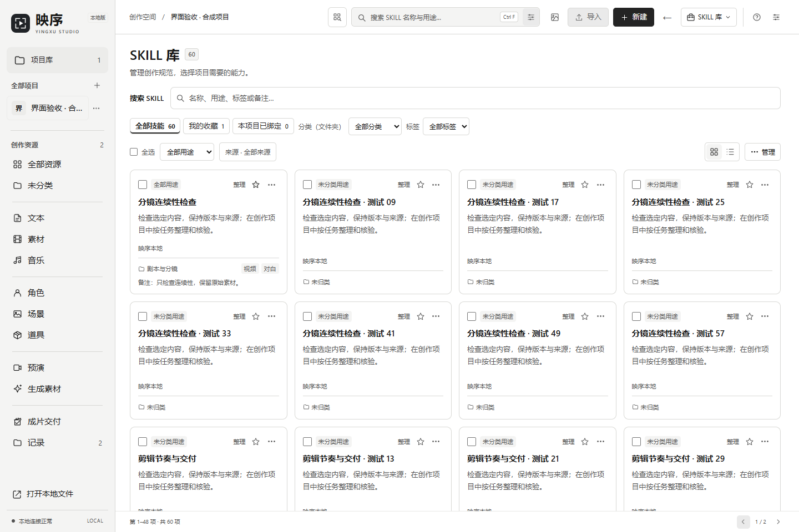
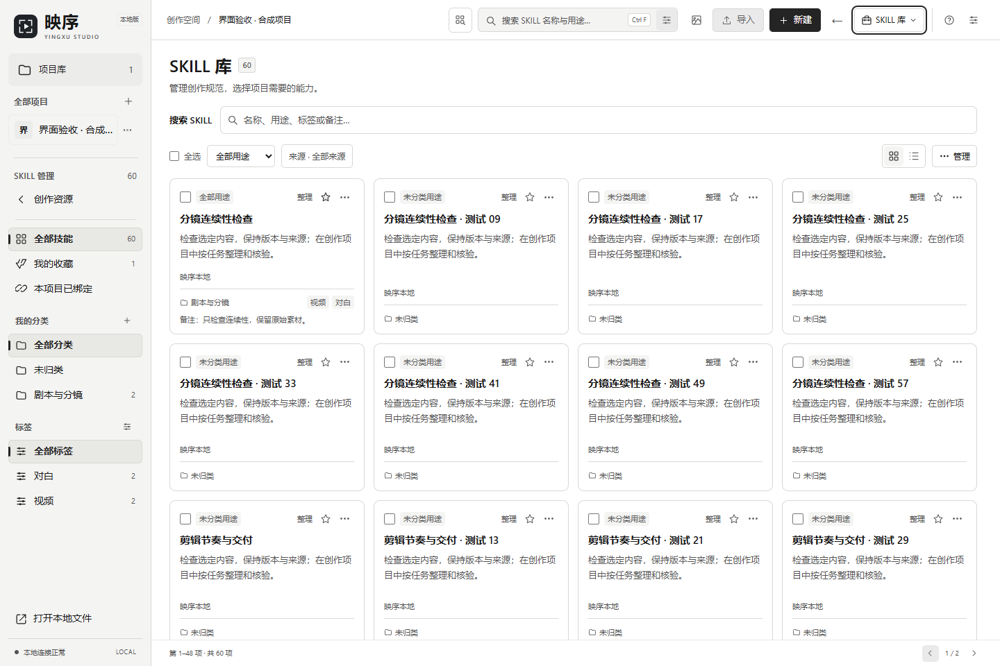
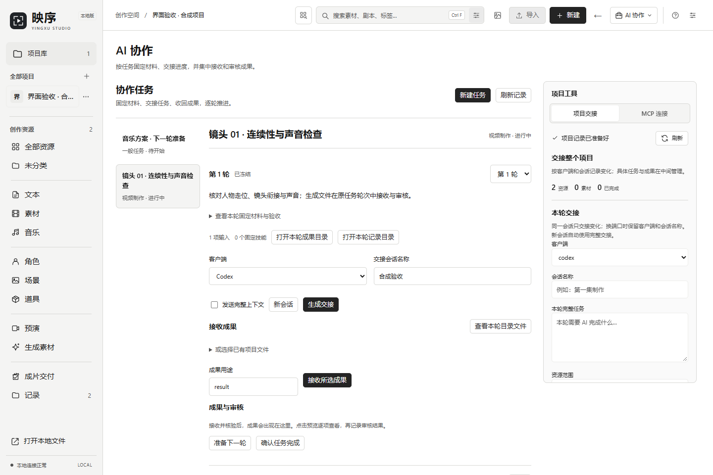
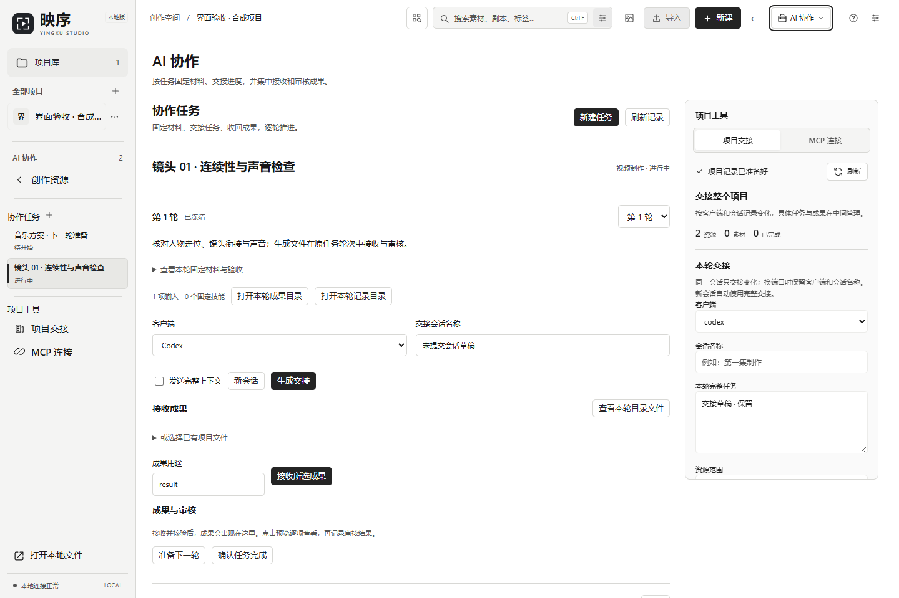

# 映序源码预览 · Stage J（2026-10-02）

映序（YingXu）以创作项目为中心管理文稿、图片、视频、声音及制作记录；可选 SKILL 与 AI 协作用于固定能力和材料、交接任务、接收并审核成果。模型、公共工具与跨项目资源可通过独立工具衔接。

## 程序下载与源码预览

| 内容 | 状态 |
|---|---|
| 当前公开 Windows 程序 | [0.4.22 / workflow.3](https://github.com/NOXEVYR/yingxu/releases/tag/yingxu-v0.4.22) |
| macOS Apple Silicon 历史试用版 | [0.4.20-mac.1](https://github.com/NOXEVYR/yingxu/releases/tag/yingxu-v0.4.20-mac.1) |
| 本分支源码 | 0.4.27 / calls.3；独立 Stage J 源码预览 |
| 本阶段原生程序包 | 尚无对应最终源码的 EXE/安装包，未发布程序 Release |

GitHub 的 Download ZIP / Source code 是开发源码，不含运行库与原生程序，不能作为自动更新包导入。旧 Stage I EXE、历史 0.4.22 启动器及内部源码 ZIP 均未改名冒充新安装包。已有稳定与 macOS 历史下载保留。

## 本阶段界面

两种模式使用相同业务与编辑宿主。原工作台固定保留资源导航；聚焦工作台在 SKILL 页显示分类/标签，在协作页显示本项目任务。SKILL 页增加直接搜索，覆盖名称、说明、路径、个人标签与备注；AI 协作右侧工具在项目交接/MCP之间切换，有界滚动，窄窗按需展开。

模式/页签切换保留草稿、输入节点与编辑器；修复刷新迟到响应的项目身份和导航重绘后的键盘焦点。磁盘分类、固定技能版本、任务轮次与 MCP 只读协议没有因布局变动而改写。五个前端程序文件净增约20.7 KiB，没有新增运行依赖。此前未公开的候选源码一并保留为预览范围，具体见相邻候选文档；它们不是已发布程序功能承诺。

## 演示数据与验证边界

截图保存于本阶段实际完整应用的隔离浏览器渲染：1440×960，1个合成项目、60个合成技能、2项协作任务和1个固定轮次。不是用户素材库，不是0.4.22下载包截图，也不是原生Windows/macOS验收或真实AI生成成果。原始PNG字节直接公开，不做绘图替代。比较图只是这四张已保存截图的拼版。

既有Stage J记录：78个前端文件（702项，1跳过），97个后端模块（1,069项，11跳过），最终执行项通过；23项完整合成页面检查通过。跳过涉及窄窗限制、符号链接权限、macOS接口及未提供的更新助手运行库。首次后端整批超时、浏览器临时目录EPERM和旧EXE元数据夹具缺失都保留在内部证据；后续按模块/Edge复验汇总。发布收尾没有重新跑产品或重型构建。

已知 macOS 构建限制：`macos/verify_release.py` 的旧版本检查仍要求0.4.25，不能用于确认当前0.4.27源码构建。此次公开收尾保留原实现并明确记录，未将其称为可发布Mac包。

新版原生门槛仍缺：与最终Stage J源码绑定的原生构建、该构建真实宿主界面验收、完整程序包一致性与回读。旧EXE元数据检查不能替代。尚未测量本阶段真实运行内存/程序包增量，不因此标稳定版。

## 公开范围

公开保留程序/测试源码与必要说明；本地阶段AGENTS、生成build.json、私有配置/授权、合成数据库、失败日志、内部来源目录和旧EXE不纳入本分支新源码成果。本分支不更新发布请求或工作流，不触发云端构建。原下载及历史附件未改变。截图摘要见 [公开来源清单](source-preview-stage-j-20261002.json)。
